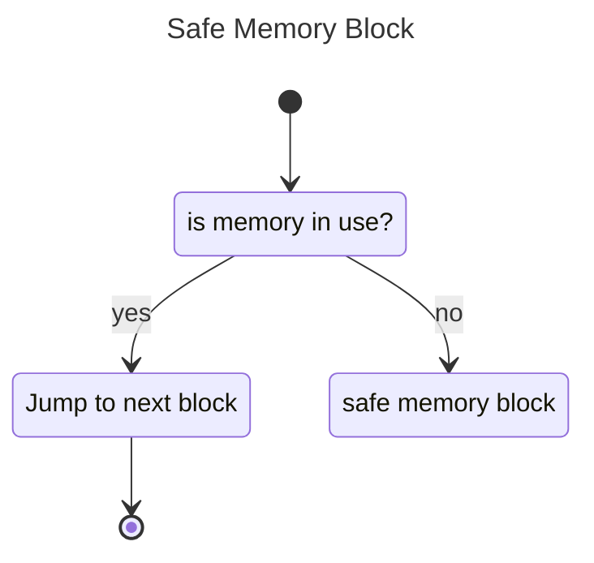

```mermaid
---
title: Safe Memory Block
---

stateDiagram-v2

    used: is memory in use?
    [*] --> used
    jmp: Jump to next block
    safe: safe memory block
    used --> jmp: yes
    used --> safe: no
    jmp --> [*]
```
